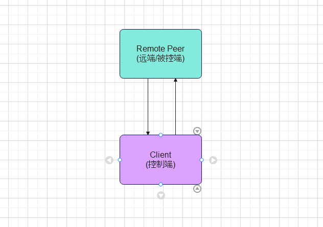
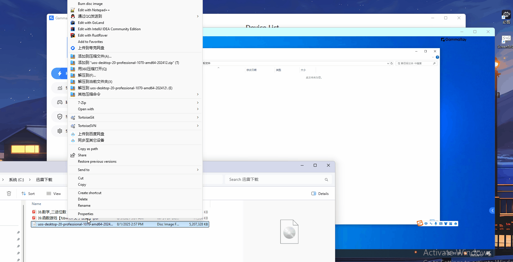
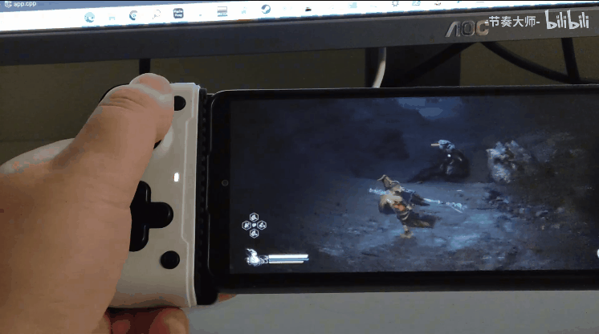
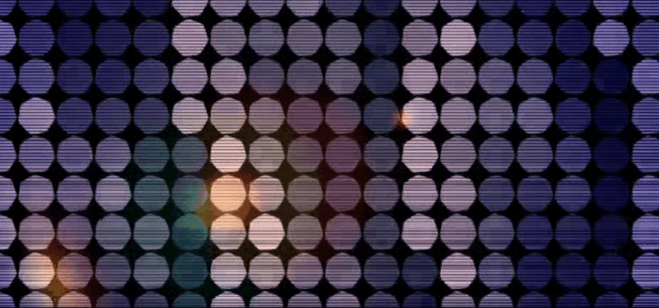
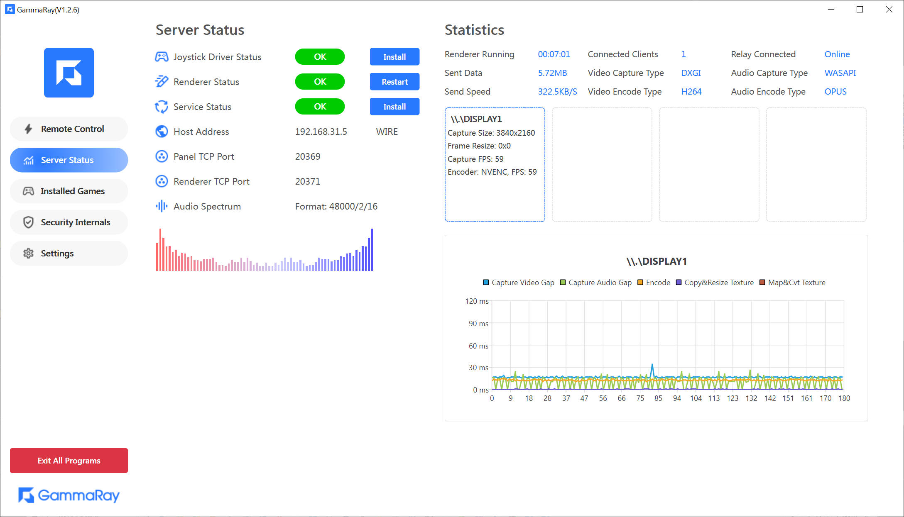
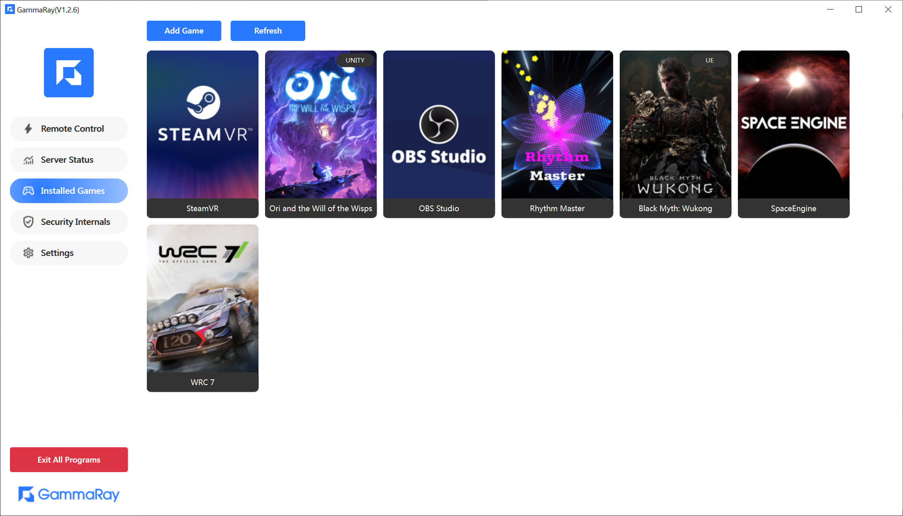
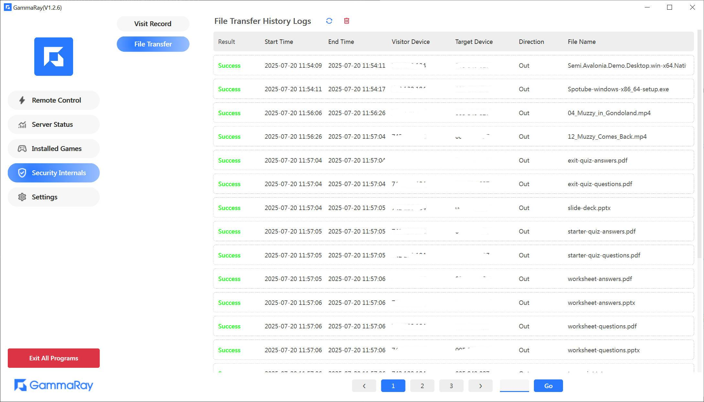
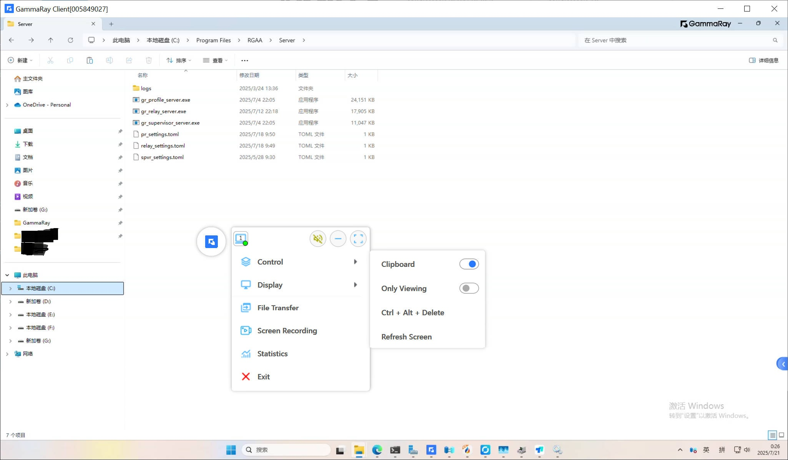
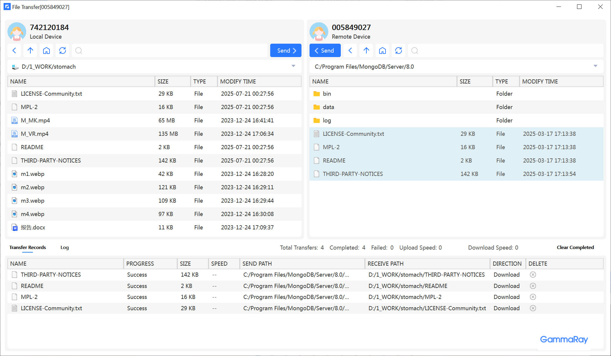
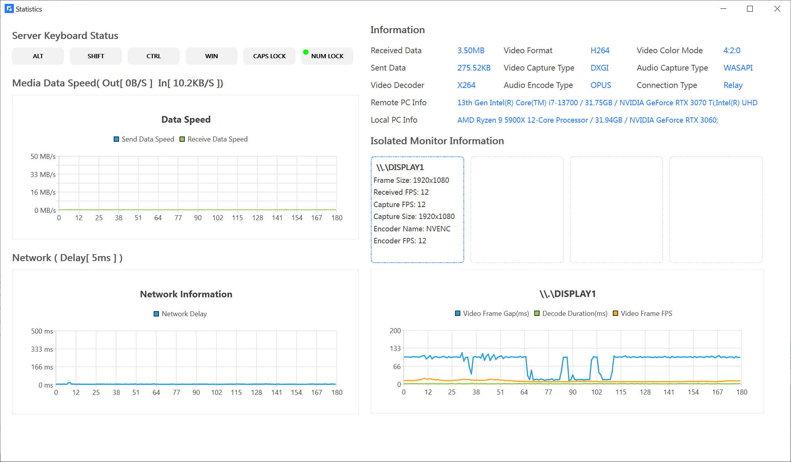

#### 💖 This Repo is the OpenSource version of [Pixels In Steam(NOT released now)](https://store.steampowered.com/app/2947460/Pixels/), please download at [HERE](https://github.com/RGAA-Software/GammaRay/releases)
#### 💖 这是Pixels的开源版, 全功能版移步[Steam(暂未开放下载)](https://store.steampowered.com/app/2947460/Pixels/)或者[Release](https://github.com/RGAA-Software/GammaRay/releases), 免费.

### Showcases
[企业功能演示](https://www.bilibili.com/video/BV1ZGDhBGEAA/)  
[B站演示地址](https://www.bilibili.com/video/BV17mvQexELk/)  
[B站演示地址(远程桌面)](https://www.bilibili.com/video/BV1qF5NzfENv/)  

## Usage
##### 1. [How To Use](docs/gammaray/How_to_use.md)
##### 2. [How To Build](docs/gammaray/How_to_build.md)
## More
#### [Official Site (官网)](https://pixels.yun)
#### [Documentation (文档)](https://docs.pixels.yun)

### GammaRay
#### ⚡️Stream your game fame and desktop to other devices, and replay gamepad,keyboard,mouse events on the host PC. In a word, It's a alternative of TeamViewer, ToDesk, RustDesk, etc.
#### ⚡️远程操作电脑，云游戏，模拟手柄等，类似ToDesk, 向日葵, RustDesk, TeamViewer的工具

## Support Platforms
✅  Ready  
⌛  Developing

| Platform | Client | Server  |
|----------|--------|---------|
| Windows  | ✅      | ✅       |
| Android  | ✅      | ⌛       |

## Work Mode (工作模式)
#### 1. Connect Directly (直连)

#### 2. Relay (转发)
> You can also connect directly in this mode  
> 此模式下亦可直连  

## Key Features
### Display multiple screens of remote computers
#### Switch display

#### simultaneous display

### File transfer
#### The transmission speed is very fast

### Transferring files via clipboard
#### The transmission speed is very fast

### Screen Recording
#### Supports simultaneous recording on multiple screens

### Detailed statistical information

### Cloud/Remote Game Recordings
#### Wukong/黑神话悟空

#### Ori/奥日

#### Elden Ring/埃尔登法环

### Music Spectrum

### Screenshots

### License
##### This project is licensed under the GNU General Public License v3.0 (GPLv3). You may use, modify and redistribute these codes under the terms of the GPLv3, including for commercial purposes, as long as derivative works are also licensed under the GPLv3.
##### 本项目采用 GNU General Public License v3.0 (GPLv3) 开源协议。你可以在 GPLv3 条款下自由使用、修改和再发布本代码（包括商用），但衍生作品必须同样以 GPLv3 开源。
