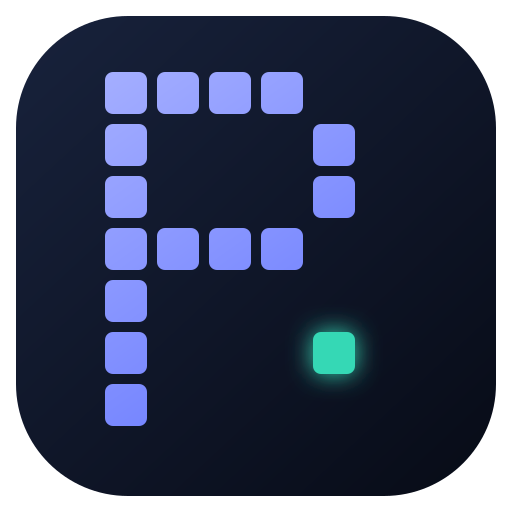
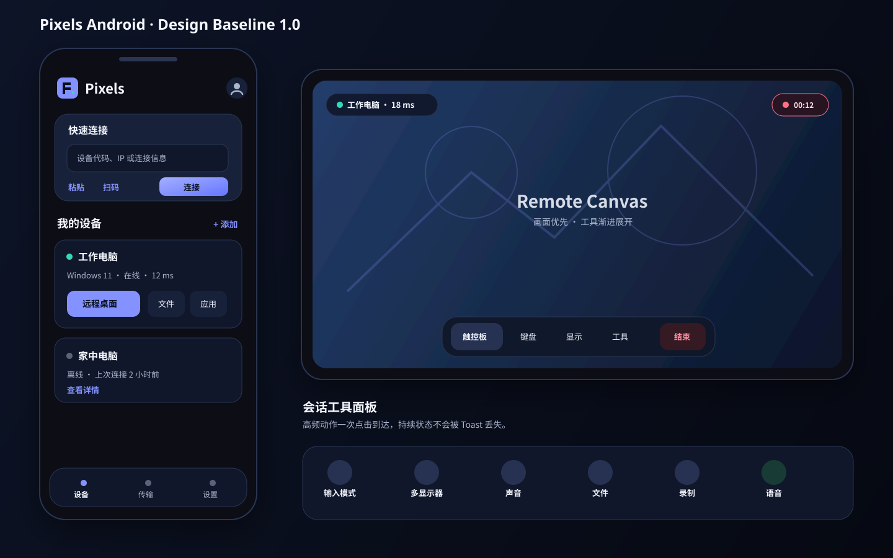

# Pixels Android UI/UX 设计规范

> 版本：Design Baseline 1.0  
> 更新日期：2026-09-05  
> 产品范围：Pixels Android Client  
> 上位产品规划：[`android_pixels_product_plan.md`](android_pixels_product_plan.md)
> 实施状态：M0 品牌、设备空状态、Quick Connect 与一级导航已落地

## 1. 设计目标

Pixels Android 是完整的移动远程桌面客户端。设计必须让第一次使用的用户快速连接，让高频用户在不离开远控画面的情况下完成输入切换、显示调整、文件传输、录制和语音操作。

设计遵守以下原则：

1. **设备优先**：用户先找到设备，再选择远程桌面、远程应用或文件等动作。
2. **画面优先**：进入会话后，远程画面是唯一主内容，工具按需出现并自动收起。
3. **模式显式**：触摸、触控板和游戏模式必须可见、可解释、可随时切换。
4. **状态可信**：连接、重连、录制、传输、语音和控制权状态不能依赖 Toast 表达。
5. **能力驱动**：服务器不支持的功能不展示；暂时不可用的功能显示原因和恢复动作。
6. **危险操作克制**：结束会话、重启、关机、删除设备和覆盖文件必须有明确对象及确认。
7. **移动端原生**：文件使用 SAF/MediaStore，键盘使用系统 IME，后台任务使用通知，不模拟桌面窗口系统。
8. **不复制竞品**：吸收设备优先、渐进工具栏等成熟交互规律，但布局、品牌、组件和动效均使用 Pixels 自有设计。

## 2. 品牌视觉

### 2.1 图标概念：Pixel Link P

图标由规则像素块组成字母 `P`，右下角有一枚独立的青绿色像素，表示另一台设备；主体和独立像素之间的空间表达跨设备连接。

```text
■■■■□
■□□□■
■□□□■
■■■■□
■□□□□
■□□□◆
■□□□□

■  Pixels 主色
◆  远端连接强调色
```

- 图标不能使用细线、文字或小于一个基本像素块的内部细节。
- Adaptive Icon 的有效图形控制在中心 66% 安全区。
- 圆形、圆角矩形和 squircle 裁切后，字母 `P` 与远端像素必须完整。
- monochrome 版本把主体和远端像素合并为一个实色轮廓。
- Wordmark 使用正常的几何无衬线字体书写 `Pixels`，不使用低可读性的像素字体。

概念矢量稿见 [`images/android_pixels_icon_concept.svg`](images/android_pixels_icon_concept.svg)。该文件是设计母版，实施时需要转化为 Android Adaptive Icon foreground/background 和 monochrome 资源。



### 2.2 色彩

深色主题是默认主题，浅色主题用于系统偏好和高亮环境。品牌色不跟随 Material Dynamic Color，避免不同设备改变 Pixels 身份。

| Token | 深色主题 | 浅色主题 | 用途 |
|---|---:|---:|---|
| `background` | `#080C18` | `#F5F7FC` | 页面背景 |
| `surface` | `#10172A` | `#FFFFFF` | 卡片、面板 |
| `surfaceRaised` | `#17213A` | `#EEF1F8` | Bottom Sheet、悬浮 Dock |
| `primary` | `#8492FF` | `#4052D6` | 主按钮、选中态 |
| `onPrimary` | `#07101F` | `#FFFFFF` | 主色上的内容 |
| `secondary` | `#35D8B5` | `#087F68` | 在线、连接端点、语音 |
| `textPrimary` | `#F5F7FF` | `#151A28` | 主文本 |
| `textSecondary` | `#AAB5CE` | `#59647A` | 辅助文本 |
| `outline` | `#2A3653` | `#D6DCE8` | 分隔和边框 |
| `success` | `#3DDC84` | `#087A43` | 成功、在线 |
| `warning` | `#FFC15C` | `#8A5300` | 弱网、等待 |
| `error` | `#FF7085` | `#BA1A32` | 错误、危险动作 |
| `scrim` | `#02040BCC` | `#10152599` | 远控工具遮罩 |

不得仅用颜色表达在线、错误、录制或选中状态；必须同时使用文字、图标或形状。

### 2.3 字体

使用 Android 系统无衬线字体，中文跟随系统 CJK 字体。数字统计使用等宽数字特性，但不引入独立像素字体。

| 样式 | 字号/行高 | 字重 | 用途 |
|---|---|---|---|
| Display | 32/40sp | 600 | 空状态和首次引导标题 |
| Headline | 24/32sp | 600 | 页面主标题 |
| Title | 20/28sp | 600 | 卡片和面板标题 |
| Body | 16/24sp | 400 | 正文、表单 |
| Body Small | 14/20sp | 400 | 辅助说明 |
| Label | 13/18sp | 600 | 按钮、标签、状态 |
| Metric | 12/16sp | 500 | 延迟、帧率、码率 |

### 2.4 网格、圆角与触控尺寸

- 基础间距单位为 4dp，常用间距为 8、12、16、20、24、32dp。
- 页面水平安全边距：手机 16dp，平板 24dp。
- 普通卡片圆角 16dp，Bottom Sheet 24dp，按钮 12dp，状态胶囊使用全圆角。
- 普通触控目标不小于 48×48dp；远控高频按钮不小于 52×52dp；游戏按钮不小于 56×56dp。
- 卡片不依赖大面积阴影。深色主题使用亮度层级和 1dp outline 区分层次。

## 3. 信息架构

### 3.1 手机导航

非会话状态使用三个一级入口：

```text
设备        传输        设置
```

- **设备**：快速连接、设备列表、扫码、设备详情和远程应用。
- **传输**：全部设备的进行中、失败和完成任务。
- **设置**：画质、输入、音频、网络、权限、诊断和关于。

进入远控工作区后隐藏一级导航，使用会话专属 Dock。系统返回键优先关闭面板，其次退出键盘/游戏编辑模式，最后才请求结束会话。

### 3.2 平板导航

- 宽度 600dp 以上使用 Navigation Rail。
- 设备页采用列表—详情双栏，不强迫用户反复跳转。
- 传输页在足够宽度下使用本地/远端双栏文件浏览。
- 远控工作区保持全屏；多显示器可以选择切换、并排或主次布局。

### 3.3 页面关系

```text
启动页
  └─ 设备首页
      ├─ 快速连接
      ├─ 扫码
      ├─ 添加设备
      └─ 设备详情
          ├─ 远程桌面 ── 连接准备 ── 远控工作区
          ├─ 远程应用 ──────────────┘
          ├─ 文件传输 ── 传输中心
          └─ 设备设置

一级传输入口 ── 传输中心
一级设置入口 ── 设置/权限/诊断/关于
```

## 4. 设备首页

### 4.1 手机线框

```text
┌──────────────────────────────────┐
│  Pixel Link P  Pixels        ◉   │
│                                  │
│  ┌────────────────────────────┐  │
│  │ 快速连接                   │  │
│  │ 设备代码、IP 或连接信息    │  │
│  │ [粘贴] [扫码]        [连接]│  │
│  └────────────────────────────┘  │
│                                  │
│  我的设备                 + 添加 │
│  ┌────────────────────────────┐  │
│  │ ● 工作电脑                 │  │
│  │ Windows 11 · 在线 · 12 ms  │  │
│  │ [远程桌面]    文件  应用  ⋮│  │
│  └────────────────────────────┘  │
│  ┌────────────────────────────┐  │
│  │ ○ 家中电脑                 │  │
│  │ 离线 · 上次连接 2 小时前   │  │
│  │ [查看详情]                  │  │
│  └────────────────────────────┘  │
│                                  │
│     设备         传输       设置 │
└──────────────────────────────────┘
```

### 4.2 关键行为

- 快速连接输入框接受设备代码、IP、完整连接文本和扫码结果，解析后先展示目标摘要再连接。
- `连接` 是首页唯一高强调主按钮；扫码和粘贴是辅助动作。
- 在线设备卡片直接提供远程桌面主动作，文件和应用作为次动作。
- 离线设备不显示无效的远控按钮，改为展示 Wake-on-LAN 或诊断动作；服务器不支持时完全隐藏。
- 扫描发现的新设备与已保存设备分区展示，避免自动发现结果改变用户持久列表。
- 下拉刷新只刷新发现和状态，不清空现有列表。

### 4.3 页面状态

| 状态 | 表现 | 主动作 |
|---|---|---|
| 首次空状态 | 插图、简短说明、扫码和添加按钮 | 扫码连接 |
| 正在发现 | 标题旁小型进度，不遮挡已保存设备 | 停止发现 |
| 无网络 | 页面顶部常驻状态条 | 打开系统网络设置 |
| 服务不可用 | 保留设备和本地记录 | 重试 |
| 解析失败 | 输入框就地错误 | 修改输入 |
| 认证需要密码 | 打开连接确认 Sheet | 输入密码 |

## 5. 设备详情

```text
┌──────────────────────────────────┐
│ ‹ 工作电脑                    ⋮  │
│ ┌──────────────────────────────┐ │
│ │ ● 在线    Windows 11         │ │
│ │ Office-PC · 1920×1080 · 12ms │ │
│ │                              │ │
│ │       [ 远程桌面 ]           │ │
│ └──────────────────────────────┘ │
│                                  │
│ 快捷操作                         │
│ [文件] [应用] [唤醒] [设备设置] │
│                                  │
│ 最近应用                         │
│ [Desktop] [Visual Studio] [Steam]│
│                                  │
│ 设备能力                         │
│ 2 台显示器 · H.265 · WebRTC     │
└──────────────────────────────────┘
```

- 详情页只展示服务器实际上报的能力，不用本地版本猜测。
- Desktop 是一种远程应用目标，与其他应用共用同一启动状态模型。
- 点击应用后显示“启动并连接”，已有实例则显示“连接现有实例”。
- 设备更多菜单包含重命名、诊断和删除；重启、关机等远程系统动作放入单独的危险操作区。

## 6. 连接准备与状态

连接过程使用 Bottom Sheet 覆盖当前设备上下文，不立即跳到空白全屏页：

```text
准备连接 → 认证 → 协商传输 → 准备音视频 → 已连接
               ↘ 可恢复失败 → 重试/更换传输
               ↘ 最终失败   → 返回设备/复制诊断
```

- 正常阶段显示当前动作，不显示伪造百分比。
- 首帧到达前可以进入工作区，但必须显示“正在等待画面”。
- 认证失败不能自动无限重试。
- 自动降级时显示一次非阻塞说明，例如“直连不可用，已切换到中继”。
- 用户可以展开技术详情查看 transport、codec、server 和错误码。

## 7. 远控工作区

### 7.1 横屏主布局

```text
┌────────────────────────────────────────────────────────────────────┐
│ [● 工作电脑 · 18 ms]                              [REC 00:12]     │
│                                                                    │
│                                                                    │
│                         远 程 画 面                                │
│                                                                    │
│                                                                    │
│              ┌──────────────────────────────────────┐              │
│              │ 触控板  键盘  显示  工具      结束  │              │
│              └──────────────────────────────────────┘              │
└────────────────────────────────────────────────────────────────────┘
```

- 顶部状态胶囊显示设备、连接质量和控制角色，2 秒后降为半透明；状态变化时重新出现。
- 录制、语音、文件任务等持续活动使用独立状态胶囊，不放入短暂 Snackbar。
- Dock 默认位于底部中央，允许拖到左右边缘；无操作 3 秒后收成一个 48dp Pixels 按钮。
- 点击空白画面不会意外展开全部菜单；点击收起的 Pixels 按钮恢复 Dock。
- TalkBack 开启时不自动收起 Dock，也不依赖拖动作为唯一操作方式。

视觉概念稿见 [`images/android_pixels_ui_concept.svg`](images/android_pixels_ui_concept.svg)。



### 7.2 竖屏布局

- 远端画面按宽度适配，未占用区域作为触控板可操作区域。
- Dock 固定在底部安全区上方，不悬浮在系统手势区域。
- 键盘出现时保持远端焦点区域可见；允许用户临时缩放画面，不强制裁剪。
- 竖屏不展示永久虚拟手柄；开启游戏模式时提示旋转横屏，用户仍可选择继续。

### 7.3 Dock 信息结构

| 一级动作 | 面板内容 |
|---|---|
| 输入模式 | 直接触摸、触控板、游戏；虚拟鼠标；灵敏度；手柄布局 |
| 键盘 | 系统键盘、修饰键条、快捷键、Ctrl+Alt+Delete |
| 显示 | 显示器、缩放、方向、画质、帧率、解码信息 |
| 工具 | 声音、剪贴板、文件、录制、语音、统计 |
| 结束 | 结束会话；危险系统动作放入二级入口并确认 |

高频动作不超过两层。Bottom Sheet 保持当前上下文，切换一级分类时不关闭再打开。

## 8. 输入模式

### 8.1 直接触摸

适合系统设置、网页和大触控目标。

| 手势 | 远端行为 |
|---|---|
| 单击 | 左键单击对应位置 |
| 双击 | 左键双击 |
| 长按后拖动 | 按住左键拖动 |
| 双指上下滑 | 滚轮 |
| 双指单击 | 右键 |
| 双指缩放 | 仅缩放本地视口，不发送输入 |

### 8.2 触控板

适合精确办公操作，手指位置与远端指针解耦。

| 手势 | 远端行为 |
|---|---|
| 单指移动 | 相对移动指针 |
| 单指单击 | 左键 |
| 双击后保持移动 | 拖动 |
| 双指滑动 | 垂直/水平滚轮 |
| 双指单击 | 右键 |
| 三指单击 | 显示或隐藏 Dock |

可选虚拟鼠标只包含左键、右键、滚轮和拖动区，不覆盖远端主要内容。第一次启用显示 20 秒内可跳过的手势提示，之后可从帮助重新打开。

### 8.3 游戏模式

- 默认横屏。
- 左侧摇杆负责移动，右侧区域负责相对视角。
- ABXY、肩键、扳机、方向键和自定义按键使用统一布局编辑器。
- 支持按键、组合键、长按、连发和轴映射，但默认模板保持简单。
- 实体手柄连接后自动提示切换；除非用户明确要求，不同时发送虚拟和实体手柄输入。
- 编辑状态有明显边框和“保存/取消”，编辑触摸不能发送到远端。

## 9. 键盘与快捷键

- 使用系统 IME，不自绘完整字母键盘。
- 键盘上方提供 `Esc`、`Tab`、`Ctrl`、`Alt`、`Shift`、`Win` 和方向键修饰条。
- 修饰键支持单次、锁定两种状态，并用颜色和图标同时表达。
- 常用快捷键包括复制、粘贴、全选、撤销、任务管理器和显示桌面。
- `Ctrl+Alt+Delete` 使用独立动作，清楚说明发送给远端。
- 组合键发送失败时保留用户当前输入，不静默丢失。

## 10. 显示与统计

显示面板先提供四个用户可理解的预设：

| 预设 | 目标 |
|---|---|
| 自动 | 根据网络和设备能力动态选择 |
| 流畅 | 优先延迟和帧率 |
| 均衡 | 默认办公与通用模式 |
| 清晰 | 优先分辨率和画质 |

分辨率、帧率、码率、codec、色彩格式和硬解开关放入“高级”。高级值必须展示服务器支持范围，不能允许提交必然失败的配置。

统计面板分两层：

- 简要：延迟、FPS、码率、丢包和 transport。
- 详细：编码/解码、渲染、音频 buffer、分辨率、颜色格式、重连次数和各阶段耗时。

多显示器在手机上使用横向预览卡切换；平板支持主次或并排布局。创建和删除虚拟显示必须显示所有权及影响范围。

## 11. 工具流程

### 11.1 文件传输

手机采用步骤式流程，不在狭窄屏幕强行模拟桌面双栏文件管理器：

```text
选择方向 → 选择源文件 → 选择目标目录 → 确认 → 任务中心
```

```text
┌──────────────────────────────────┐
│ 传输中心                         │
│ [进行中 2] [已完成] [失败 1]    │
│                                  │
│ ↑ design.pdf                     │
│ 工作电脑 / Desktop               │
│ ████████████░░  72% · 8.4 MB/s  │
│ [取消]                           │
│                                  │
│ ↓ recording.mp4                  │
│ 正在等待网络                     │
│ [重试]                           │
│                                  │
│                [发送文件]        │
└──────────────────────────────────┘
```

平板可以使用本地/远端双栏，但底层仍是同一个传输任务模型。退出页面不取消任务，通知和传输中心共享唯一状态源。

### 11.2 剪贴板

- 默认使用显式“发送到远端”和“复制远端内容”动作，避免未经用户感知地读取移动端剪贴板。
- 会话前台可提供自动同步开关，并持续显示启用状态。
- 文本先展示摘要，敏感内容不进入日志和通知。
- 图片和文件展示可访问的 URI、大小和授权期限；授权失效时要求重新选择。

### 11.3 录制

- 点击录制后立即显示常驻红色状态胶囊和时长。
- 停止后显示保存进度，成功时提供查看、分享、删除。
- 磁盘不足、编码格式不支持或音频缺失必须分别说明。
- 应用退后台不自动停止录制，除非系统限制导致失败；失败必须形成持久结果。

### 11.4 语音

- 工具面板显示“呼叫”“麦克风”“扬声器”和音频输出设备。
- 呼叫中使用绿色状态胶囊，点击可快速静音、切扬声器或挂断。
- 首次呼叫时按需申请麦克风权限，不在启动应用时申请。
- 被拒绝后说明哪些功能仍可使用，并提供打开系统设置的动作。

## 12. 平板与折叠屏

```text
┌────────┬──────────────────────┬────────────────────────────┐
│ Pixels │ 设备                 │ 工作电脑                   │
│        │ ● 工作电脑           │ 在线 · Windows 11          │
│ 设备   │ ○ 家中电脑           │                            │
│ 传输   │ ● 游戏主机           │ [远程桌面] [文件] [应用]   │
│ 设置   │                      │                            │
│        │                      │ 最近应用 / 设备能力        │
└────────┴──────────────────────┴────────────────────────────┘
```

- 600–839dp：Navigation Rail + 单内容区。
- 840dp 以上：设备列表和详情双栏。
- 折叠屏跨铰链时不把主按钮、Dock 或对话框放在铰链区域。
- 外接键鼠存在时自动显示指针模式提示，但不擅自改变用户已选择的输入模式。
- 外接显示器可用于远端画面，手机本体保留控制面板；这是增强能力，不阻塞首个垂直切片。

## 13. 状态、错误与恢复

### 13.1 会话状态

| 状态 | 主要 UI |
|---|---|
| Preparing | 设备信息和取消按钮 |
| Authenticating | 密码/授权说明 |
| Negotiating | transport 和 codec 协商信息 |
| WaitingForFirstFrame | 工作区骨架和等待画面提示 |
| Streaming | 远程画面与 Dock |
| Recovering | 保留最后一帧并加暗色遮罩，显示重连原因和次数 |
| Ending | 禁止新输入，等待资源逆序关闭 |
| Ended | 结果、重连和返回设备动作 |

### 13.2 错误表达

错误必须包含：发生了什么、当前影响、用户能做什么、可复制诊断码。禁止只显示 `connect failed`、异常类名或原始 errno。

| 类型 | 示例主文案 | 动作 |
|---|---|---|
| 认证 | 密码不正确 | 重新输入 |
| 网络 | 无法到达工作电脑 | 重试、网络诊断 |
| 能力 | 远端不支持 H.265 | 切换 H.264 |
| 权限 | Pixels 无法访问麦克风 | 授权、暂不使用语音 |
| 空间 | 存储空间不足，录制已停止 | 管理存储、查看已保存片段 |
| 会话 | 控制权已转移，当前为观看模式 | 申请控制、继续观看 |

## 14. 动效与反馈

- 普通状态切换 120–180ms，面板展开 220–280ms，页面共享元素不超过 320ms。
- 远控画面、输入事件和连接状态不等待装饰动画。
- 触摸按钮按下时立即改变亮度/缩放并可提供轻触觉反馈。
- 连接成功、切换显示器和进入游戏模式使用轻反馈；错误和断线使用不同的较强反馈，但尊重系统触觉设置。
- 系统“减少动态效果”启用时关闭缩放、位移和循环动画。

## 15. 无障碍与文案

- 正文和关键控件满足 WCAG AA 对比度目标。
- 所有图标按钮有可读 label，状态点有文字语义。
- 字体放大到 200% 时，设备连接、结束会话和权限流程仍可完成。
- 不用“确定/失败”作为脱离上下文的文案，使用“连接工作电脑”“结束会话”“重新授权麦克风”等明确动作。
- 中英文字符串从第一天进入资源文件；UI 不能硬编码文案。
- 时间、文件大小、速度、键盘布局和数字格式遵循系统 locale。

## 16. Compose 组件契约

首批稳定组件如下：

| 组件 | 职责 |
|---|---|
| `PixelsAppBar` | 品牌、页面标题和一级动作 |
| `QuickConnectCard` | 连接信息输入、粘贴、扫码和解析错误 |
| `DeviceCard` | 设备身份、在线状态和上下文动作 |
| `ConnectionSheet` | 连接阶段、认证、降级和失败恢复 |
| `RemoteCanvas` | Surface 生命周期和视口，不拥有会话 |
| `SessionStatusChip` | 连接质量、角色、录制、语音和传输状态 |
| `RemoteCommandDock` | 远控一级动作和自动收起 |
| `RemoteToolSheet` | 输入、显示、键盘和工具的上下文面板 |
| `ModifierKeyBar` | 键盘修饰键和快捷键状态 |
| `TransferTaskCard` | 单任务进度、错误、取消和重试 |
| `CapabilityAction` | 根据服务端能力展示、禁用或解释动作 |
| `PersistentErrorBanner` | 需要用户处理且不能被 Snackbar 丢失的错误 |

所有组件接收不可变状态和值回调，不直接查询单例、数据库、JNI 或 Service。

## 17. 首批实现切片

设计落地不先制作全部静态页面，而按完整用户路径实施：

1. Pixels Theme、Adaptive Icon、Splash 和三个一级导航入口。
2. 设备空状态、Quick Connect、设备卡片和连接确认 Sheet。
3. RemoteCanvas、会话状态胶囊和可收起 Dock。
4. 直接触摸/触控板切换、系统键盘和显示器切换。
5. 传输中心、剪贴板、录制、语音和详细统计。
6. 平板双栏、游戏布局编辑和高级显示能力。

每个切片必须同时交付加载、空、成功、失败、恢复和无权限状态，不把异常页面推迟到最后补做。

## 18. 设计验收门禁

- 新用户从冷启动到发起首次连接不超过三个明确决策步骤。
- 远控中的输入模式、连接质量、录制和语音状态在一次点击内可见。
- 手机横屏中，Dock 收起后远程画面没有永久大面积遮挡。
- 所有会话工具都能在两层以内到达。
- 文件任务离开页面后继续存在，并能从通知和传输入口回到同一任务。
- Activity、Surface 或 Compose 重建不会让 UI 显示与真实会话状态分离。
- 手机、平板、折叠屏以及系统字体 200% 均可完成连接和安全退出。
- 页面中不出现 GammaRay、XRay、Thunder Cloud 或旧 Android 图标。
- UI 不展示服务端未声明的能力，也不存在点击后仅由 RTC stub 返回失败的假入口。
- 设计组件可以直接映射到不可变 `UiState`、类型化 action 和自动化测试语义。
