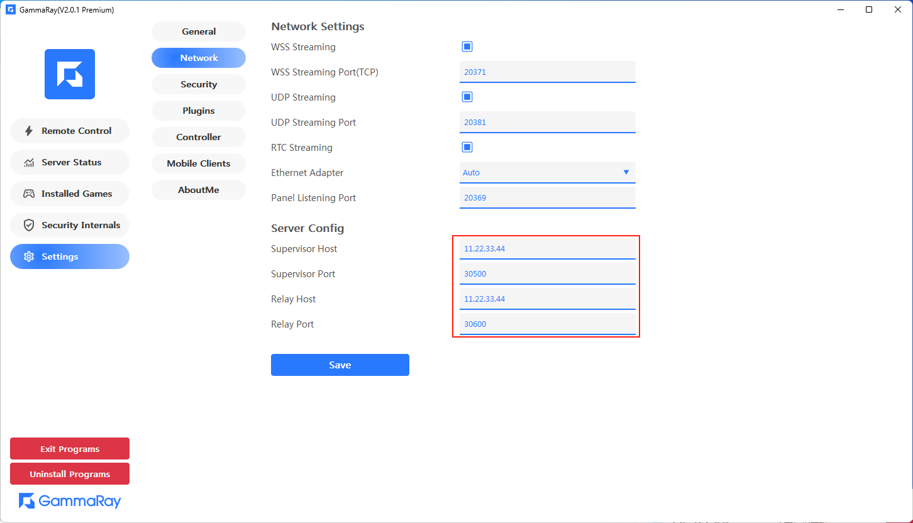
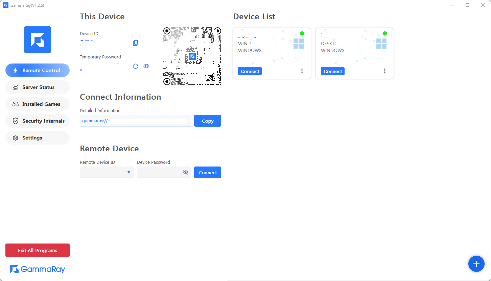
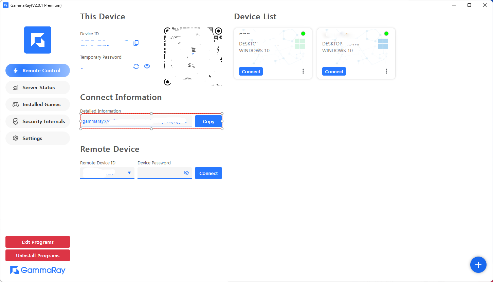
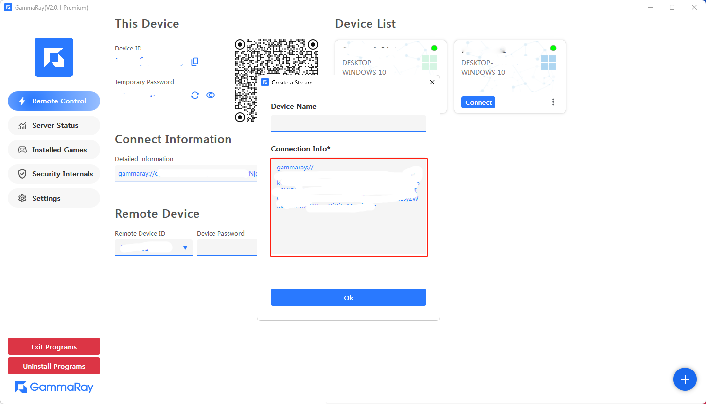
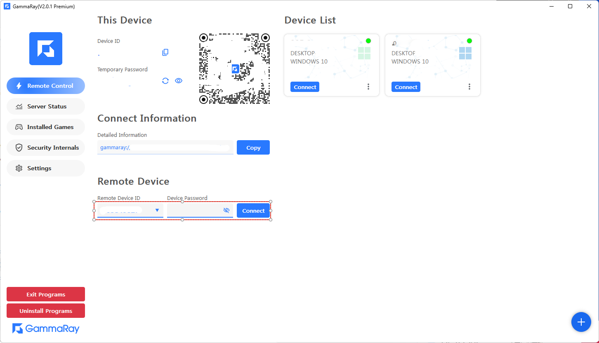

#### 1. Prepare
> 1.1 Install **Redis**  
> 1.2 Install **MongoDB**
> 

#### 2. Download server binaries
##### [Github Link](https://github.com/RGAA-Software/GammaRay/releases)

#### 3. There are 2 binaries
> 3.1 **Spvr**  ==> ID Generator/Manager.  
> 3.2 **Relay**  ==>  Relay the media info  

```
.
├── certs/
│   ├── cert.pem
│   └── key.pem
├── gr_spvr_server
├── gr_spvr_settings.toml
├── gr_relay_server
└── gr_relay_settings.toml

```

#### 4. Modify the settings
> You MUST change the **server_w3c_ip** field to your own
> 
#### SPVR Server
```toml
# 如果mongodb装在本机，只需要改一下外网地址即可
# If your mongodb installed in same machine, just to modify the [server_w3c_ip] to your External Ip.

# name
server_name = "Srv.Supervisor.01"

# 此机器的外网IP
# w3c ip
server_w3c_ip = "192.168.1.111"

# 需要对外开放的端口
# port
server_port = 30500

# single deploy
single_deploy = true

# show ui
show_ui = true

# 如果mongodb装在本机，不用修改
# mongodb url
mongodb_url = "mongodb://localhost:27017/"
```

#### Relay Server
```toml
# name
server_name = "Srv.Relay.01"

# 此机器的外网IP
# w3c ip
server_w3c_ip = "192.168.1.111"

# 需要对外开放的端口
# working server port
server_working_port = 30600

# SPVR服务如果运行在同一台电脑，不需要修改
####### SPVR Server IP #######
# spvr server ip
spvr_server_ip = "127.0.0.1"

# SPVR服务如果运行在同一台电脑，不需要修改
####### SPVR Server PORT #######
# spvr server port
spvr_server_port = 30500

# redis装在本机，则不需要修改
# redis url address
redis_url = "redis://127.0.0.1:6379/"

# 无特殊需求，不用修改
# grpc server port
# <Inner Used>
server_grpc_port = 40600
```

#### 5. Run the servers
> No orders required here, just starting them as you want.  
> You may start in sequence of gr_profile_server.exe -> gr_relay_server.exe -> gr_supervisor_server.exe
> 
#### 6. Set the information in Panel and save it.


#### 7. Then, you'll get your device id


#### 8. There are 2 ways to connect remote devices
##### 8.1 Use the connect information.
**The Remote device information**

**Paste in client and start connection**

##### 8.2 Use your ID and password
