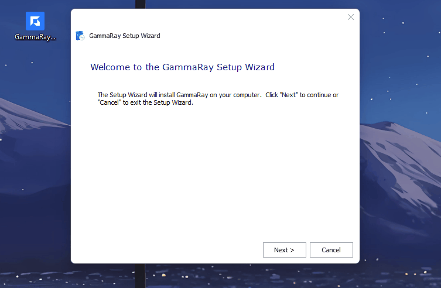
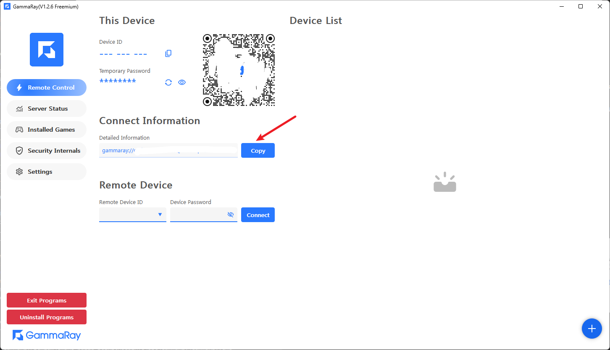
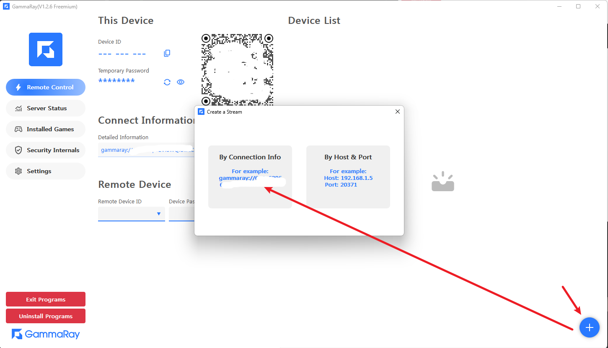
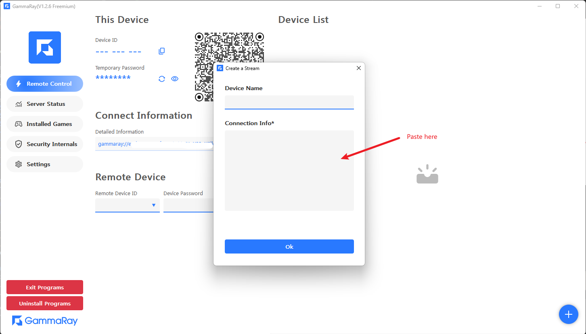
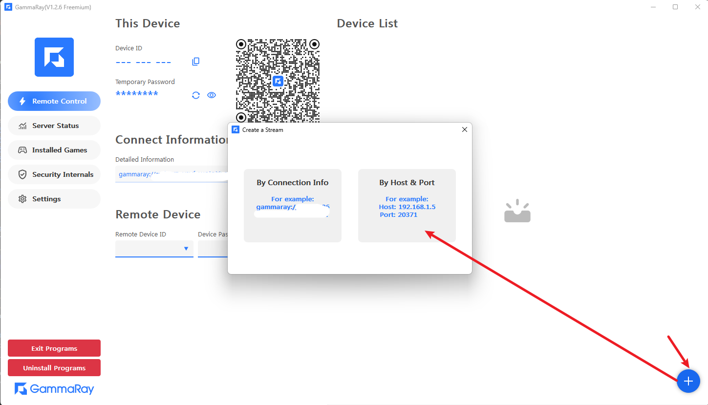
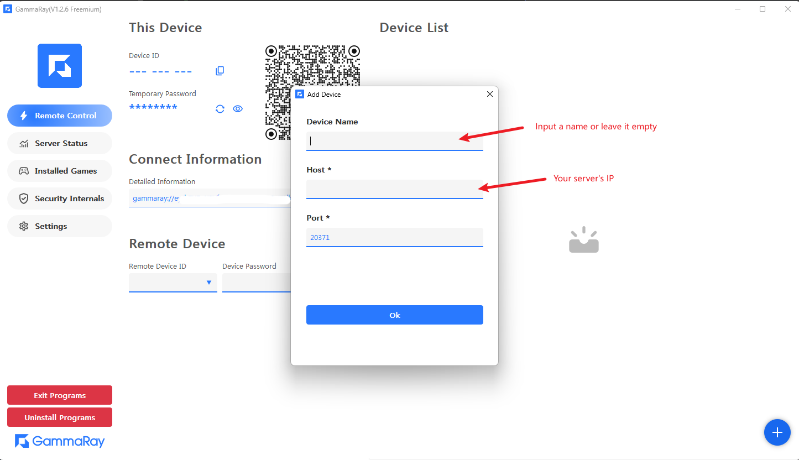

### Installation
> There are two ways to achieve this
#### Method 1. Extract the zip and double-click GammaRay.exe
#### Method 2. Double-click installer to install it
run GammaRaySetup.exe

### Windows
#### 1. Direct Mode(By Connect Information)
> You can access the machine directly, eg:  
> a. You are in the same router  
> b. The server has an External IP
##### 1.1 Copy the server information

##### 1.2 Paste it in

##### 1.3 Click OK to connect
> You can leave the **Device Name** empty

#### 2. Direct Mode(By IP/Port)
> You can access the machine directly, eg:  
> a. You are in the same router  
> b. The server has an External IP

##### 2.1 Input your server's IP
> Using the default port is ok

### Android

旧 GammaRay Android 客户端及其使用流程已经退役。新的 Pixels Android 客户端正在原地重建，不兼容旧包名、旧数据、旧页面或旧安装升级路径。M0 品牌、设备首页和导航基线已经完成并通过 USB 真机安装；M1 已接通手动主机/`link://` 的 Panel 信息验证和设备持久化，远程会话能力仍在继续实施。

在 Pixels Android 达到发布门禁前，不应继续发布或引用本节原有的旧版截图和操作步骤。最终产品范围、架构和验收标准见 [Pixels Android 客户端最终产品规划](../android_pixels_product_plan.md)。
